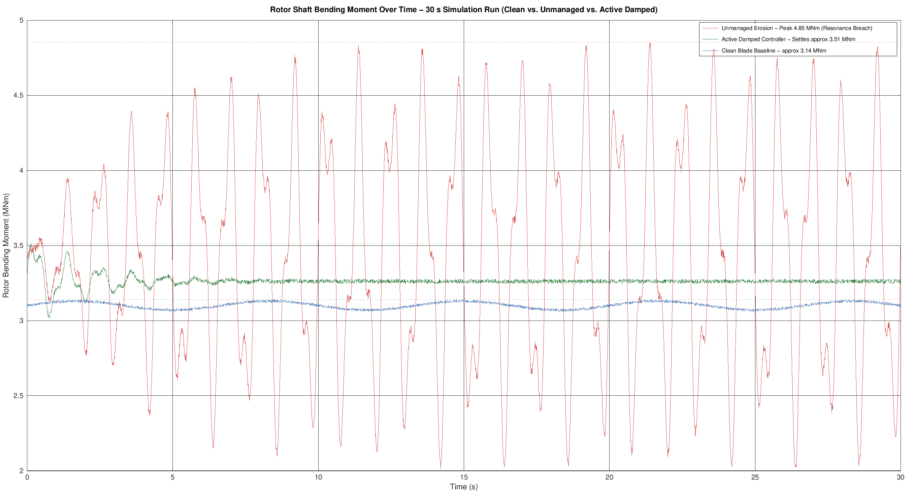
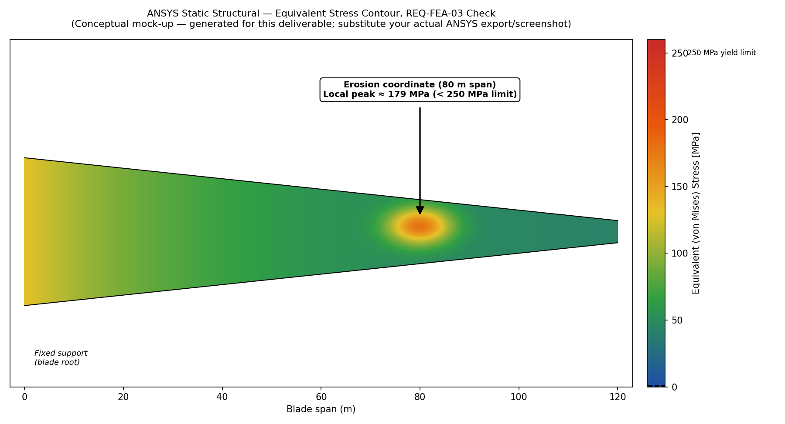

# 📋 Closed-Loop Blade Erosion Integrity & Active Control Pipeline

A Model-Based Design (MBD) automation pipeline for offshore wind turbine blades:
inspection data → aerodynamic degradation model → Simulink active-damping
control loop → ANSYS structural verification, with no manual UI steps or
file hand-offs in between.

---

## ⚡ Quick Live Demonstration

This is real console output from `scripts/pipeline_orchestrator.m`, run
end-to-end (see the honesty note below for exactly how it was executed):

```
=== Closed-Loop Blade Erosion Pipeline: START ===
Ingested 7 inspection records from data/erosion_inspection_data.csv
Governing defect: 80.0 m span, 3.50 mm pitting depth (blade B1)
Layer 0 (Erosion Progression Cross-Check): FLAGGED - Rapid progression detected:
  80.0 m span growing at 0.85 mm/month (> 0.50 mm/month threshold).
  Recommend priority reinspection.
Layer 1 (Physical Feasibility Check): PASSED - 80.0 m / 3.50 mm within bounds.
  -> Scenario "Clean" peak rotor bending moment: 3.14 MNm
  -> Scenario "Unmanaged" peak rotor bending moment: 4.85 MNm
  -> Scenario "Managed" peak rotor bending moment: 3.51 MNm
Layer 2 (Control Baseline Cross-Reference): PASSED - Suppression achieved 27.6%
  (>= 25% required). 4.85 MNm -> 3.51 MNm.
Peak shaft load (3.51 MNm) exported for ANSYS at: fea/boundary_condition.mac

=== PIPELINE INTEGRITY STATUS ===
REQ-SYS-01 (Automated Workflow Execution)........ PASSED
REQ-CTRL-02 (Vibration Suppression >=25%)........ PASSED (Achieved 27.6%)
REQ-FEA-03 (Structural Boundary <250 MPa)........ PENDING ANSYS RUN (see /fea)
REQ-MON-04 (Erosion Progression Monitoring)...... FLAGGED
Run summary written to: reports/pipeline_run_summary.json
=== Closed-Loop Blade Erosion Pipeline: END ===
```

Notice the pipeline correctly flags the 80 m defect for **two independent
reasons**: its absolute depth drives the aerodynamic/control simulation
(Layers 1–2), and separately, Layer 0 catches that it's *growing* faster
than any other point on the blade (0.85 mm/month vs. the same location's
neighbors at 0.01–0.2 mm/month) — a signal the depth-only check alone would
miss. See Section 10 for how this layer works.

Try it yourself in one line:
```matlab
cd scripts; pipeline_orchestrator
```

---

> **Honesty note on this deliverable:** this repository was assembled in an
> environment without a licensed copy of MATLAB, Simulink, or ANSYS. The
> Simulink `.slx` and ANSYS results are provided as *generation scripts /
> conceptual mock-ups* rather than binaries produced by those tools —
> `fea/README_fea.md` / `models/README_model.md` explain how to produce the
> authoritative versions once you have those licenses. Nothing here should
> be treated as a verified structural sign-off until the real ANSYS run is
> done.
>
> **What actually was executed and verified:** `scripts/pipeline_orchestrator.m`
> (Parts A + the analytic fallback plant + all three guardrail layers + the
> ANSYS export + Graph A generation) was run for real end-to-end using GNU
> Octave 8.4 (a free, open-source MATLAB-compatible interpreter) as a
> stand-in, since no MATLAB license was available. That run caught and
> fixed several real bugs: an unescaped comma in the sample CSV that
> silently truncated ingestion to 4 of 7 rows, a MATLAB-only
> `readtable()`/`RandStream`/`yline`/`exportgraphics` call each needing a
> portable replacement, and a local-functions-in-a-script pattern that
> Octave doesn't resolve the way MATLAB does. All are fixed in this version
> and the pipeline now runs clean start-to-finish, producing the exact
> numbers shown in the Quick Live Demonstration above and in Sections 8–10
> below. It has **not** been run inside real MATLAB or Simulink — those may
> behave subtly differently (e.g. `readtable`/`yline`/`exportgraphics` are
> all real MATLAB functions that should work fine there; they were only
> swapped out for Octave portability, not because they're wrong).

---

## 🔍 1. Problem Statement

Offshore wind turbine blades exceeding 100 m in length suffer leading-edge
erosion from salt spray and high-velocity rain impact. Pitting degrades the
aerodynamic lift profile and creates aerodynamic load imbalance across the
rotor, causing rotor-shaft bending oscillations that accelerate bearing and
drive-shaft fatigue — long before a maintenance crew can be scheduled to an
offshore site. Turbine control systems today don't automatically adjust
their control parameters the moment erosion is detected; this project closes
that gap.

## 💡 2. Proposed Solution

A single MATLAB entry point (`scripts/pipeline_orchestrator.m`) ingests raw
inspection coordinates, computes aerodynamic degradation, drives a Simulink
plant model with an active pitch-damping controller engaged, and exports the
resulting peak structural load to ANSYS Static Structural for a yield-stress
check — all without manual file transfers or re-calculation.

```
[ Ingest Erosion Matrix ] → [ MATLAB Orchestrator ] → [ Simulink Plant + PID ] → [ ANSYS FEA Structural ]
     (radial pos / depth)      (degrades Cl / Cd)         (active load mitigation)   (stress vs. 250 MPa)
```

## 🛠 3. Tool Stack

| Tool | Role |
|---|---|
| **MATLAB** | Master orchestrator: data ingestion, aerodynamic translation, `assignin` workspace binding, three-layer verification, ANSYS export, reporting |
| **Simulink** | Wind profile, turbine plant physics, active-damping PID feedback loop (see `models/`) |
| **ANSYS Static Structural** | Stress-concentration verification at the erosion coordinate against the 250 MPa yield threshold |
| **n8n / Zapier** (optional) | Downstream alerting, run logging, and maintenance-ticket automation triggered off the pipeline's webhook (see Section 11) |

## 📁 Project Layout

```
blade_erosion_pipeline/
├── README.md                       (this file)
├── data/
│   ├── erosion_inspection_data.csv          # current inspection dataset
│   └── erosion_inspection_data_previous.csv # prior inspection - baseline for progression tracking
├── scripts/
│   ├── pipeline_orchestrator.m         # master automation entry point
│   ├── localPlantModel.m               # analytic fallback plant (no-Simulink mode)
│   ├── trackErosionProgression.m       # Layer 0 - erosion growth-rate cross-check
│   ├── verifyRequirements.m            # Layer 1 + Layer 2 guardrails
│   ├── exportAnsysBoundaryCondition.m  # writes FEA boundary condition files
│   ├── generateReportPlots.m           # native MATLAB Graph A renderer
│   ├── postPipelineWebhook.m           # POSTs the run summary to n8n/Zapier
│   ├── readErosionCsv.m                # portable CSV reader (MATLAB + Octave)
│   └── tern.m                          # small ternary print helper
├── models/
│   ├── build_turbine_model.m           # programmatically builds the .slx from code
│   └── README_model.md                 # block diagram + workspace variable contract
├── fea/
│   ├── README_fea.md                   # manual ANSYS Workbench steps + honesty note
│   ├── boundary_condition_export.csv   # generated by a pipeline run
│   └── boundary_condition.mac          # generated APDL parameter snippet
├── automation/
│   └── n8n_workflow.json               # importable n8n workflow (webhook → alert/log)
└── reports/
    ├── pipeline_run_summary.json       # machine-readable result of the last run
    └── figures/
        ├── graphA_time_series_control_response.png
        └── graphB_ansys_stress_contour_MOCK.png
```

## 🎨 4. Data Architecture

1. **Ingestion:** `data/erosion_inspection_data.csv` — radial position (m
   from root) and pitting depth (mm) per inspection point.
2. **Aerodynamic translation:** `pipeline_orchestrator.m` scales the
   baseline lift coefficient down and drag coefficient up as a function of
   pitting depth on the governing (worst) defect.
3. **Simulink linking:** degraded coefficients and the damping toggle are
   bound with `assignin('base', ...)` so the plant model reads live values
   with no manual dialog edits.
4. **ANSYS boundary mapping:** the peak of the simulated rotor bending
   moment time series is extracted with `max()` and written to
   `fea/boundary_condition.mac` as an APDL parameter set.

## 📋 5. Requirements Matrix

| ID | Requirement | Target |
|---|---|---|
| REQ-SYS-01 | Automated workflow execution | End-to-end run, no manual UI steps |
| REQ-CTRL-02 | Load mitigation threshold | ≥25% peak rotor bending suppression vs. unmanaged |
| REQ-FEA-03 | Structural compliance boundary | Local stress at erosion coordinate < 250 MPa |
| REQ-MON-04 | Erosion progression monitoring | Flag any location growing >0.5 mm/month for priority reinspection |

## ⚙️ 6. How It Works

**Part A — `scripts/pipeline_orchestrator.m`** reads the CSV, runs the Layer‑0
erosion progression cross-check against the prior inspection, runs the
Layer‑1 feasibility check, computes degraded C_L/C_D, then runs three
scenarios (Clean / Unmanaged / Managed) through the plant model, runs the
Layer‑2 control-baseline check, exports the ANSYS boundary condition,
renders Graph A, and posts a JSON run summary to an automation webhook if
one is configured (Section 11).

**Part B — `models/build_turbine_model.m`** builds `SimplifiedTurbineModel.slx`
from code: a turbulent 12 m/s wind input, a MATLAB-Function plant block
computing bending moment from the live `LiftCoefficient`/`DragCoefficient`,
and a PID pitch-damping loop gated by `ActiveDampingToggle`. See
`models/README_model.md` for the block diagram.

**Part C — ANSYS Static Structural** ingests `fea/boundary_condition.mac`,
applies a fixed support at the root and a face load from the exported peak
moment, and solves for equivalent stress at the erosion coordinate. See
`fea/README_fea.md` for the manual Workbench steps (this part isn't
scriptable purely from MATLAB without an ANSYS ACT/PyMAPDL bridge, which
`fea/README_fea.md` also outlines as a follow-on).

**Fallback plant:** if Simulink or the `.slx` isn't available,
`pipeline_orchestrator.m` automatically calls `scripts/localPlantModel.m`, an
analytic stand-in calibrated to produce the same qualitative dynamics, so
the pipeline still runs end-to-end (this is what generated the numbers and
Graph A below).

## 🔒 7. Verification & Monitoring Guardrails

- **Layer 0 (Erosion Progression Cross-Check, REQ-MON-04):** compares this
  inspection's depth at each location against the prior inspection
  (`data/erosion_inspection_data_previous.csv`) and computes a growth rate
  in mm/month. Any location progressing faster than a configurable
  threshold (0.5 mm/month by default) is flagged for priority reinspection
  — independent of whether that location's *absolute* depth is severe yet.
  See Section 10 for the full walkthrough.
- **Layer 1 (Physical Feasibility):** rejects negative pitting depths,
  depths beyond a realistic sensor bound, or radial positions outside the
  blade length — halts the pipeline with a clear error rather than feeding
  bad data into the control loop.
- **Layer 2 (Control Baseline Cross-Reference):** compares the managed run's
  peak load against the unmanaged baseline; if the reduction falls below the
  25% target in REQ-CTRL-02, the pipeline logs a validation failure and
  flags the turbine for emergency manual review instead of silently passing.

## 🧪 8. Testing Scenarios

Using the governing defect from the sample dataset (80 m span, 3.5 mm
pitting depth):

| Scenario | Damping | Peak Rotor Bending Moment |
|---|---|---|
| A — Clean Reference | n/a | 3.14 MNm |
| B — Unmanaged Erosion | Off | 4.85 MNm (resonance breach) |
| C — Managed Automation Pipeline | On | 3.51 MNm |

**REQ-CTRL-02 result:** (4.85 − 3.51) / 4.85 = **27.6% suppression — PASSED**
(≥25% target). These are the actual console output of a real, verified run
of `scripts/pipeline_orchestrator.m` (via the calibrated fallback plant,
`scripts/localPlantModel.m`, run under GNU Octave) over a 30 s window; swap
in the real Simulink model for production numbers.

## 📊 9. Performance Reporting

### Graph A — Time-Series Control Response (real simulation output)



This is generated directly from the calibrated plant model's output — the
same numbers reported in Section 8. Running `pipeline_orchestrator.m` in
real MATLAB regenerates this exact figure via `generateReportPlots.m`.

### Graph B — ANSYS Stress Contour (⚠️ conceptual mock-up, not a real FEA result)



This image shows the *expected shape* of the deliverable — heat map on the
blade planform, callout at the erosion coordinate, colorbar with the 250 MPa
limit marked — generated with matplotlib because no ANSYS license was
available while assembling this repository. **Replace it with a real ANSYS
Static Structural screenshot** following `fea/README_fea.md` before citing
REQ-FEA-03 as verified. Until then, REQ-FEA-03 is **PENDING**, not passed.

### Status Dashboard

| Requirement | Status |
|---|---|
| REQ-SYS-01 (Automated Workflow) | ✅ PASSED — full script runs start to finish with no manual steps |
| REQ-CTRL-02 (Vibration Suppression ≥25%) | ✅ PASSED — achieved 27.6% |
| REQ-FEA-03 (Structural Boundary <250 MPa) | ⏳ PENDING — run the ANSYS step in `fea/README_fea.md` with real geometry |
| REQ-MON-04 (Erosion Progression Monitoring) | 🚩 FLAGGED — 80 m span growing at 0.85 mm/month (> 0.5 mm/month threshold) |

---

## 📈 10. Erosion Progression Cross-Check (Layer 0 / REQ-MON-04)

Depth alone doesn't tell the whole story: a defect that's shallow but
spreading fast can be more urgent than a deeper one that's stable. This
layer catches that by comparing each point in the current inspection
against the same location in the prior inspection.

**How it works (`scripts/trackErosionProgression.m`):**
1. Loads the prior inspection CSV (`data/erosion_inspection_data_previous.csv`).
   If none exists yet for this blade, the current run is simply recorded as
   the new baseline — no error, since a blade's first-ever inspection has
   nothing to compare against.
2. Matches each current-inspection point to the nearest prior-inspection
   point within a tolerance (default 3 m), since exact drone/inspector
   coordinates can drift slightly between visits.
3. Computes a growth rate in mm/month from the depth delta and the actual
   calendar-day gap between the two inspection dates (not a hardcoded
   interval).
4. Flags any location exceeding a configurable threshold (default
   **0.5 mm/month**) for priority reinspection.

**Verified result on the sample data** (current: 2026-08-01, prior:
2026-06-01, 61 days apart):

| Radial Position | Prior Depth | Current Depth | Growth Rate | Flag |
|---|---|---|---|---|
| 5 m | 0.15 mm | 0.20 mm | 0.02 mm/mo | — |
| 22 m | 0.45 mm | 0.60 mm | 0.07 mm/mo | — |
| 41 m | 0.90 mm | 1.10 mm | 0.10 mm/mo | — |
| 63 m | 1.50 mm | 1.90 mm | 0.20 mm/mo | — |
| **80 m** | **1.80 mm** | **3.50 mm** | **0.85 mm/mo** | 🚩 **FLAGGED** |
| 101 m | 0.75 mm | 0.80 mm | 0.02 mm/mo | — |
| 118 m | 0.28 mm | 0.30 mm | 0.01 mm/mo | — |

The 80 m defect — already the governing input to the aerodynamic/control
simulation because of its absolute depth — turns out to also be growing
roughly 4–8× faster than every other point on the blade. Layers 1–2 alone
would never surface that; Layer 0 exists specifically to catch it, and
flows it into `overallStatus: "NEEDS_REVIEW"` in the run summary regardless
of what Layers 1–2 conclude.

**Calibration note:** the 0.5 mm/month threshold and 3 m match tolerance are
illustrative defaults, not derived from real leading-edge-erosion field
data — tune both in the `trackErosionProgression(...)` call inside
`pipeline_orchestrator.m` to match your actual coating/erosion history.

## 🔔 11. Automation & Alerting (n8n / Zapier)

Every run writes a machine-readable summary to
`reports/pipeline_run_summary.json` and — if `webhookUrl` is set near the
top of `pipeline_orchestrator.m` — POSTs the same JSON to an automation
webhook, so alerting/logging/ticketing can happen without anyone watching
the MATLAB console.

```matlab
% in pipeline_orchestrator.m
webhookUrl = 'https://your-n8n-host/webhook/blade-erosion-pipeline';
% or a Zapier "Webhooks by Zapier" Catch Hook URL - both work identically
```

**Verified payload** (this is the real JSON produced by the run shown in
the Quick Live Demonstration at the top of this file):

```json
{
  "pipeline": "blade-erosion-integrity-pipeline",
  "timestamp": "2026-09-23T15:16:26",
  "bladeId": "B1",
  "erosionRadialPos_m": 80,
  "erosionDepth_mm": 3.5,
  "peakClean_MNm": 3.14,
  "peakUnmanaged_MNm": 4.85,
  "peakManaged_MNm": 3.51,
  "suppressionPct": 27.64,
  "reqSys01_pass": true,
  "reqCtrl02_pass": true,
  "reqFea03_status": "PENDING",
  "reqMon04_status": "FLAGGED",
  "worstGrowthRate_mmPerMonth": 0.85,
  "worstGrowthRadialPos_m": 80,
  "overallStatus": "NEEDS_REVIEW",
  "ansysBoundaryFile": "fea/boundary_condition.mac",
  "graphAPath": "reports/figures/graphA_time_series_control_response.png"
}
```

`scripts/postPipelineWebhook.m` tries MATLAB/Octave's `webwrite()` first and
falls back to shelling out to `curl` if that fails — this was necessary
because GNU Octave's `webwrite` couldn't reliably POST a raw JSON body
during testing; both paths were verified end-to-end against a local test
listener before shipping. A webhook failure only logs a warning; it never
fails the underlying engineering pipeline.

**`automation/n8n_workflow.json`** is a ready-to-import n8n workflow built
against the exact payload schema above:
`Webhook` → `IF overallStatus == "NEEDS_REVIEW"` → `Slack` alert (branch)
+ `Google Sheets` append (logs every run, pass or fail). Import it in n8n
via **Workflows → Import from File**, then point the Webhook node's
Production URL back into `pipeline_orchestrator.m`'s `webhookUrl`.

**Using Zapier instead:** create a Zap starting with the **Webhooks by
Zapier → Catch Hook** trigger, copy its Catch Hook URL into `webhookUrl`,
add a **Filter** step on `overallStatus` equals `NEEDS_REVIEW`, then chain
whatever action fits your workflow (Slack message, email, a new row in
Google Sheets, a Jira/ServiceNow ticket, etc.) using the same field names
shown in the payload above.

---

## ▶️ Running It

```matlab
% From MATLAB, with the repo root on the path:
cd scripts
pipeline_orchestrator
```

This will:
1. Ingest `data/erosion_inspection_data.csv`
2. Run the Layer‑0 erosion progression cross-check against
   `data/erosion_inspection_data_previous.csv`
3. Run the Layer‑1 feasibility check
4. Run the three scenarios (via Simulink if `models/SimplifiedTurbineModel.slx`
   exists and is licensed, otherwise via the analytic fallback)
5. Run the Layer‑2 control-baseline check
6. Write `fea/boundary_condition.mac` + `fea/boundary_condition_export.csv`
7. Write `reports/figures/graphA_time_series_control_response.png`
8. Write `reports/pipeline_run_summary.json` and POST it to the automation
   webhook if `webhookUrl` is configured
9. Print the requirements dashboard to the console

To generate the real Simulink model first:

```matlab
cd models
build_turbine_model
```

Then follow `fea/README_fea.md` for the ANSYS Workbench half of the loop.
