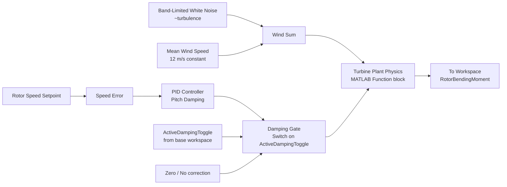

# Simulink Model: `SimplifiedTurbineModel.slx`

This folder ships the model **as code** (`build_turbine_model.m`) rather than as a
committed binary `.slx`, so it stays diffable/reviewable like the rest of the
pipeline and doesn't drift out of sync with the orchestrator's expectations.

## To generate the model

```matlab
cd models
build_turbine_model
```

This requires MATLAB + Simulink (with the PID Controller / MATLAB Function /
Signal Routing block libraries, all part of base Simulink). It writes
`SimplifiedTurbineModel.slx` into this folder.

`scripts/pipeline_orchestrator.m` automatically detects whether the `.slx`
exists and Simulink is licensed:
- **If yes:** it runs the real model via `sim()`.
- **If no:** it falls back to `scripts/localPlantModel.m`, an analytic plant
  that reproduces the same qualitative dynamics, so the full pipeline
  (ingestion → control → export) is still runnable end-to-end for review,
  CI, or machines without a Simulink seat.

## Block diagram (what `build_turbine_model.m` constructs)



| Block | Purpose |
|---|---|
| `TurbulentWindNoise` + `MeanWindSpeed` | Generates the 12 m/s turbulent wind profile (REQ test condition) |
| `TurbinePlantPhysics` | MATLAB Function block computing rotor aerodynamic bending moment from `LiftCoefficient` / `DragCoefficient` (read live from the base workspace via `assignin`) and the incoming pitch command |
| `RotorSpeedSetpoint` / `SpeedError` / `PitchDampingPID` | The active damping feedback loop — reads rotor speed fluctuation and computes a corrective micro-pitch command |
| `DampingGate` | Switch gated by `ActiveDampingToggle`; passes the PID's pitch command through when the controller is engaged, otherwise forces zero correction (this is how Scenario B "Unmanaged" and Scenario C "Managed" are produced from the *same* model) |
| `LogBendingMoment` | `To Workspace` block that exposes `RotorBendingMoment` back to `pipeline_orchestrator.m` as `simOut.RotorBendingMoment` |

## Workspace variables the model expects (bound by the orchestrator)

| Variable | Set by | Meaning |
|---|---|---|
| `LiftCoefficient` | `pipeline_orchestrator.m` via `assignin('base', ...)` | Degraded C_L for the current scenario |
| `DragCoefficient` | same | Degraded C_D for the current scenario |
| `ActiveDampingToggle` | same | `1` = damping engaged (Scenario C), `0` = disengaged (Scenario B) |
